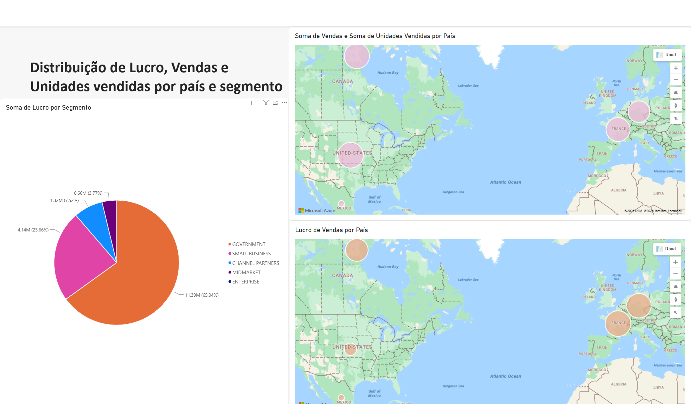

# 📊 Relatório Analítico de Vendas e Lucros — Power BI

Este repositório contém a solução desenvolvida para o desafio prático do curso **Power BI Analyst** na [DIO](https://dio.me/). O objetivo principal do projeto foi construir visuais para análise de dados financeiros, com foco na distribuição geográfica de vendas/unidades e na rentabilidade por segmento de mercado.

---

## 📌 Estrutura do Dashboard (Página 3)

A página criada do relatório é composta pelos seguintes elementos visuais:

1. **Visual de Pizza — Lucro por Segmento:**
   - Exibe a proporção do lucro gerado por cada segmento de cliente (`Government`, `Small Business`, `Enterprise`, etc.).
2. **Visual de Mapa 1 — Vendas e Unidades Vendidas por País:**
   - Mapeia geograficamente a soma de vendas e o volume físico de unidades comercializadas.
3. **Visual de Mapa 2 — Lucro por País:**
   - Mapeia o desempenho financeiro líquido por localização geográfica.

---

## 🛠️ Tecnologias e Ferramentas Utilizadas

* **Power BI Desktop:** Modelagem de dados, criação de visuais e formatação do layout.
* **Power BI Service:** Publicação e gerenciamento do relatório em ambiente em nuvem.
* **DAX (Data Analysis Expressions):** Agregações e métricas de desempenho.
* **GitHub:** Versionamento e documentação do projeto.

---

## 💡 Medidas DAX Utilizadas

```dax
-- Total de Lucro
Total Profit = SUM(Financials[Profit])

-- Total de Vendas
Total Sales = SUM(Financials[Sales])

-- Total de Unidades Vendidas
Total Units Sold = SUM(Financials[Units Sold])

